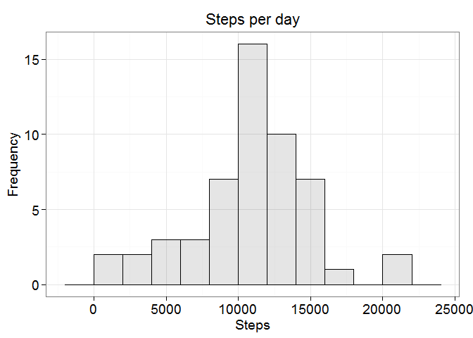
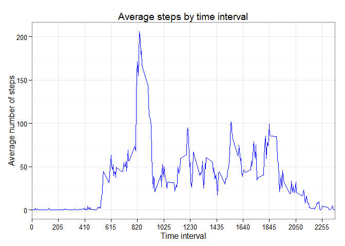
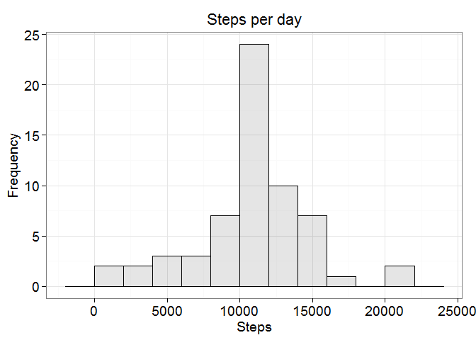
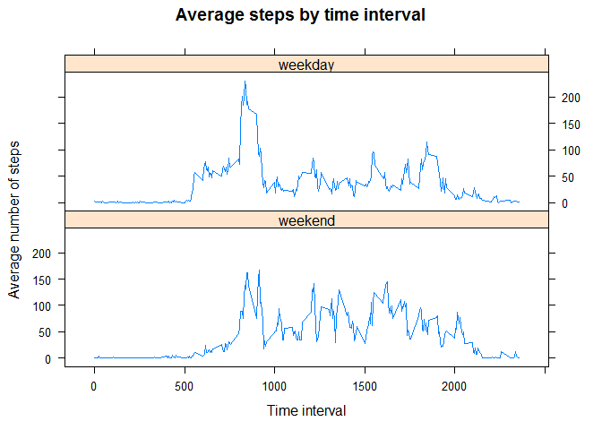

# Reproducible Research: Peer Assessment 1


## Loading and preprocessing the data  
The following code loads the libraries used for analysis


```r
#The function "verify_and_install" 
#check if a package is installed and it 
#installs if that is not installed
verify_and_install<-function(name_package)
{
  if(name_package %in% rownames(installed.packages())==FALSE)
  {install.packages(name_package)}
}

verify_and_install("dplyr")    
verify_and_install("ggplot2")
verify_and_install("lattice")
verify_and_install("readr")

#suppressMessages supress the message printed on load library dplyr
suppressMessages(library(dplyr))
library(ggplot2)
library(lattice)
library(readr)
```


Load the data file activity.csv

```r
activity <- read_csv("activity.csv",
                     col_types = list(
                       steps=col_integer(),
                       date=col_date(),
                       interval=col_integer()),
                     col_names = TRUE
                     )
```

## What is mean total number of steps taken per day?

Check if there are columns with NA value in the data set. Only column steps has NA values.

```r
summary(activity)
```

```
##      steps             date               interval     
##  Min.   :  0.00   Min.   :2012-10-01   Min.   :   0.0  
##  1st Qu.:  0.00   1st Qu.:2012-10-16   1st Qu.: 588.8  
##  Median :  0.00   Median :2012-10-31   Median :1177.5  
##  Mean   : 37.38   Mean   :2012-10-31   Mean   :1177.5  
##  3rd Qu.: 12.00   3rd Qu.:2012-11-15   3rd Qu.:1766.2  
##  Max.   :806.00   Max.   :2012-11-30   Max.   :2355.0  
##  NA's   :2304
```

The following code calculates the total number of steps taken per day.I have to do a remark here: in R for a vector with all the values NA, sum returns zero whereas mean and median returns NA (or NAN). The corect outcome is NA (or NAN). I find how to avoid this bug (see http://www.r-bloggers.com/perculiar-behaviour-of-the-sum-function/ ) and I used in my code that trick when I computed the sum. <a name="df"></a>

```r
df <- activity %>%
      group_by(date) %>%
      summarize(steps_per_day = sum(steps, na.rm = any(!is.na(steps))))
```

The following code makes a histogram of the steps taken per day and afer that calculates the mean and median of the total number of steps taken per day. <a name="Hist1"></a>

```r
df1<-df %>% filter(is.na(steps_per_day)==FALSE)

ggplot(data=df1, aes(steps_per_day)) + 
  geom_histogram(binwidth=2000,col="black", fill="black", alpha = .1) + 
  labs(title="Steps per day")+labs(x="Steps", y="Frequency") +
  theme_bw()+
  theme(axis.title.y=element_text(vjust=1, size=14), 
        axis.title.x=element_text(vjust=.3, size=14),
        axis.text=element_text(size=14),
        title=element_text(vjust=1.2, size=14)) 
```

 


```r
#Calculate and report the mean and median of the total number of steps taken per day

meanValue <- mean(df$steps_per_day, na.rm=TRUE) 
medianValue <- median(df$steps_per_day, na.rm=TRUE)

meanR <- format(meanValue, big.mark=",", scientific=FALSE)
medianR <- format(medianValue, big.mark=",", scientific=FALSE)
```
Mean of the total number of steps taken per day is 10,766.19.   
Median of the total number of steps taken per day is 10,765. 

## What is the average daily activity pattern?

The next code makes a time series plot of the 5-minute interval (x-axis) and the average number of steps taken, averaged across all days (y-axis).

```r
dataSeries <- activity %>%
              group_by(interval) %>%
              summarize(steps_per_day = mean(steps, na.rm = TRUE))

ggplot(data=dataSeries, aes(x=interval, y=steps_per_day)) + 
  geom_line(aes(group=1), color="blue") + 
  theme_bw() + 
  scale_x_discrete(breaks=seq(0, 2355, 205)) + 
  xlab("Time interval") + ylab("Average number of steps") + 
  labs(title="Average steps by time interval")
```

 


```r
#find the interval which contains the number max of steps
position<-which(dataSeries$steps_per_day==max(dataSeries$steps_per_day))
interval<-dataSeries$interval[position]
```
The interval which contains the number max of steps (on average across all the days) is 835. 

## Imputing missing values

```r
NANumber<-nrow(activity[complete.cases(activity)==FALSE,])
```
The data set contains 2304 NA values.

I conceived a strategy for filling in all of the missing values in the dataset.
The values NA were replaced with the mean for the time interval across the data set.
The following code create a new dataset that is equal to the original dataset but with the missing data filled in (named activity_imp).


```r
#imputation
#compute mean for each interval of time and save all in a new dataframe named dtemp
#inner_join between activity and dtemp
#create a new column new_steps
#remove the columns steps and val_new from data.frame
#rename the column new_steps
#save all in dataframe activity_imp

dtemp <- activity %>% 
         group_by(interval) %>%
         summarize(val_new=mean(steps, na.rm=TRUE)) 

#suppressMessages supress the message printed by the execution of inner_join function
suppressMessages(  
{activity_imp <-activity %>%
               inner_join(dtemp) %>%
               mutate(new_steps=ifelse(is.na(steps), round(val_new),steps))%>%
               select(-c(steps, val_new)) %>%
               rename(steps=new_steps)}
)
```

The following code makes a histogram of the steps taken per day and afer that calculates the mean and median of the total number of steps taken per day. I used the new data set
activity_imp. <a name="dfimp"></a> <a name="Hist2"></a>   

```r
#calculates the total number of steps taken per day using 
df_imp <- activity_imp %>%
          group_by(date) %>%
          summarize(steps_per_day = sum(steps))

ggplot(data=df_imp, aes(steps_per_day)) + 
  geom_histogram(binwidth=2000, col="black", fill="black", alpha = .1) + 
  labs(title="Steps per day") +labs(x="Steps", y="Frequency") +
  theme_bw()+
  theme(axis.title.y=element_text(vjust=1, size=14), 
        axis.title.x=element_text(vjust=.3, size=14),
        axis.text=element_text(size=14),
        title=element_text(vjust=1.2, size=14)) 
```

 

```r
#Calculate and report the mean and median total number of steps each day.
meanValInp <- mean(df_imp$steps_per_day, na.rm=TRUE)
medianValInp <- median(df_imp$steps_per_day, na.rm=TRUE)
meanRImp<-format(round(meanValInp), big.mark = ",", scientific = FALSE)
medianRImp<-format(round(medianValInp), big.mark = ",", scientific = FALSE)
```
Mean of the total number of steps taken per day is 10,766. 
Median of the total number of steps taken per day is 10,762. 

After I applied my imputation strategy and I computed the new values for mean an median,
I observed that the new value of mean is very close from the calculated value before.
Also the new value of median is slightly smaller than the value of median computed before.
In conclusion the new estimations of mean and median don't differ too much from previous estimates. 

####What is the impact of imputing missing data on the estimates of the total daily number of steps? 

I have a dataframe df ([df](#df)) and a dataframe df_imp ([dfimp](#dfimp)). Using this two dataframes I build two histograms (see [hist1](#Hist1) and [hist2](#Hist2)). There are difference between histograms. I want to know where are the differences.  I used the following code to find this differences.


```r
#compute maximum on the column steps_per_day for both dataframe (df si df_imp)
m1<-max(df$steps_per_day,na.rm=TRUE) 
m2<-max(df_imp$steps_per_day)
m<-format(round(m1), big.mark = ",", scientific = FALSE)
m1==m2
```

```
## [1] TRUE
```

```r
#for each interval [v, v*1000+1] (where v is seq(1,22000,1000)) finds how many days have
#number total of steps in that interval
func1<- function(x) {
                      nrow(df %>% filter(steps_per_day<1000+x & steps_per_day>=x))
                    }

func2<- function(x) {
                      nrow(df_imp %>% filter(steps_per_day<1000+x & steps_per_day>=x))
                    }
v1<-sapply(v<-seq(1,22000,1000), func1)
v2<-sapply(v<-seq(1,22000,1000), func2)

v2-v1
```

```
##  [1] 0 0 0 0 0 0 0 0 0 0 8 0 0 0 0 0 0 0 0 0 0 0
```

```r
index<-which(v2-v1>0)
i<-format(index,  big.mark = ",", scientific = FALSE)

i1<-format((index-1)*1000+1, big.mark = ",", scientific = FALSE)
i2<-format(index*1000+1, big.mark = ",", scientific = FALSE)

N1<-nrow(df %>% filter(steps_per_day<index*1000+1 & steps_per_day>=(index-1)*1000+1))
N2<-nrow(df_imp %>% filter(steps_per_day<index*1000+1 & steps_per_day>=(index-1)*1000+1))
N2-N1
```

```
## [1] 8
```

I observe that the maxim value for steps_per_day is the same (21,194) in both dataframes(df and df_imp). Due the comparison of v1 with v2 I observe that just the elements from position 11 are different. For df_imp dataframe number of days with total number of steps between 10,001 and 11,001 is 18. For df dataframe number of days with total number of steps between 10,001 and 11,001 is 10. In conclusion, due the method of imputation which I used, it has increased (with 8) the number of days which has total number of steps between 10,001 and 11,001.

## Are there differences in activity patterns between weekdays and weekends?
The next code create a new factor variable in the dataset with two levels - "weekday" and "weekend" indicating whether a given date is a weekday or weekend day.

```r
activity_f<- activity_imp %>% 
             mutate(day=weekdays(date)) %>%
             mutate(temp1=weekdays(date) %in% c("Sunday","Saturday")) %>%
             mutate(temp2=ifelse(temp1==TRUE, "weekend", "weekday")) %>%
             mutate(WDay=factor(temp2, levels=c("weekend", "weekday"))) %>%
             select(-c(temp1, temp2))
```

The following code create a panel plot containing a time series plot of the 5-minute interval (x-axis) and the average number of steps taken, averaged across all weekday days or weekend days (y-axis).

```r
dataSeries <- activity_f %>% 
              group_by(interval, WDay) %>%
              summarise(meanDay=mean(steps))  
  
  xyplot(meanDay ~ interval | WDay, dataSeries, 
         type="l", 
         lwd=1, 
         main="Average steps by time interval" ,
         xlab="Time interval", 
         ylab="Average number of steps", 
         layout=c(1,2))
```

 


